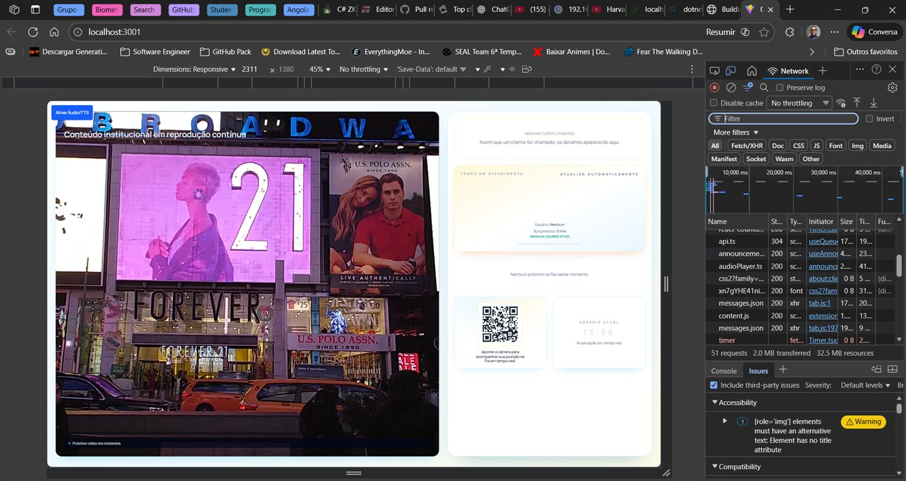
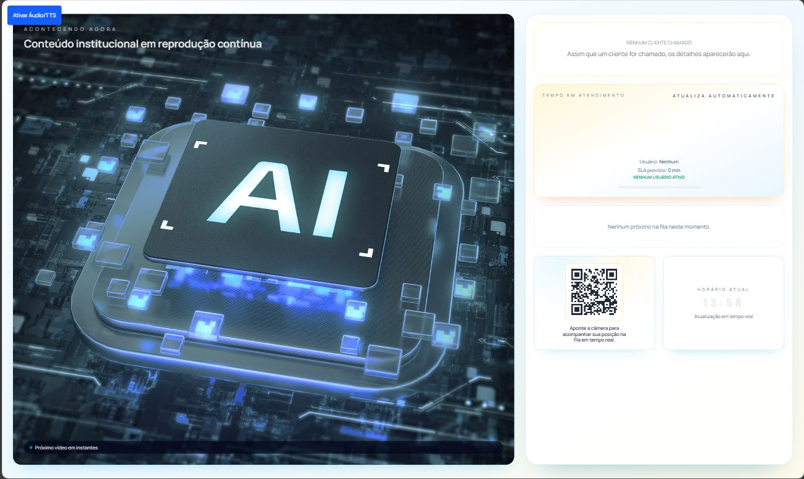
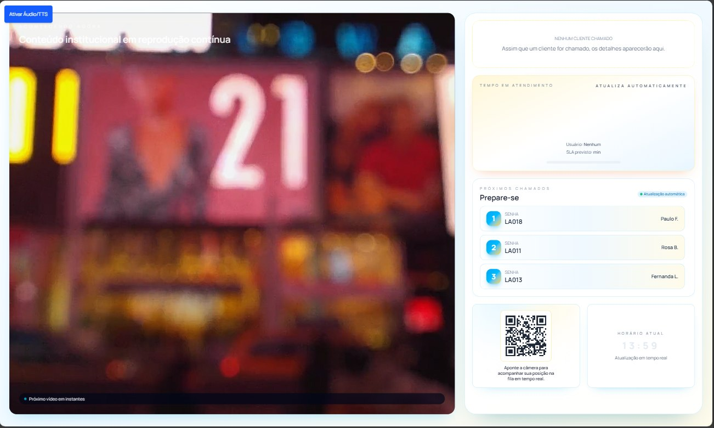

> [info] Este post serve também para validar o suporte a posts organizados por diretório, com imagens locais dentro da pasta do artigo.

## Contexto

Neste artigo quero registrar, de forma simples e objetiva, como foi o processo de desenvolvimento do QMS, quais decisões tomei ao longo do caminho e como a interface foi evoluindo.

O objetivo não é apenas mostrar o resultado final, mas também preservar o raciocínio por trás da construção do sistema.

## Visão geral da interface

Uma das partes mais importantes do projeto foi garantir clareza visual e uma estrutura que transmitisse organização desde o primeiro contato.

## Evolução do fluxo

Ao longo do desenvolvimento, fui ajustando o fluxo de navegação e a apresentação das informações para que o sistema ficasse mais natural de usar e mais coerente com o contexto do produto.

## Decisões de implementação

Algumas decisões foram especialmente importantes durante a construção:

- manter a interface consistente entre secções;
- reduzir ruído visual;
- dar prioridade à leitura rápida;
- estruturar o projeto de forma que cada parte pudesse crescer sem bagunçar o resto.

## Resultado

No estágio atual, o QMS já mostra uma direção visual e estrutural mais madura, e isso foi fundamental para transformar a ideia em algo mais sólido e apresentável.

## Conclusão

Este post também funciona como exemplo de como documentar um projeto com imagens locais por artigo. A partir daqui, cada novo post pode ter a sua própria pasta com:

- `index.md`;
- imagens do artigo;
- outros assets específicos, se necessário.
