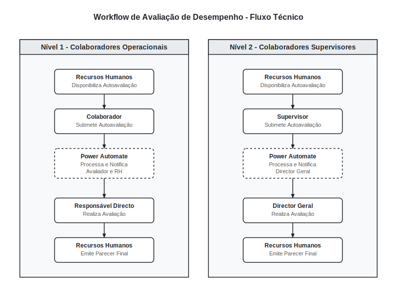
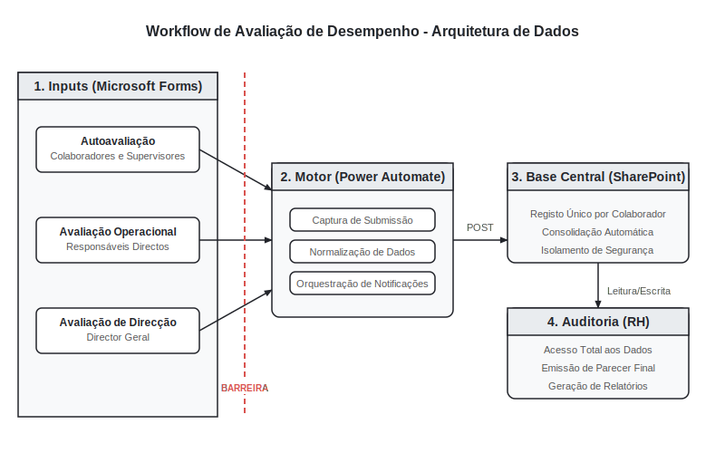

## O Desafio de Negócio

Em organizações em crescimento, o processo de avaliação de desempenho de colaboradores é crítico, mas frequentemente sofre de ineficiência operacional, falhas de confidencialidade e descentralização de dados. O processo tradicional baseado em folhas de cálculo Excel enviadas por e-mail ou formulários em papel apresenta riscos elevados:
1. **Falta de Confidencialidade:** Avaliadores e avaliados podem aceder indevidamente a dados uns dos outros, comprometendo a imparcialidade do processo.
2. **Gargalo de Consolidação:** O Departamento de Recursos Humanos (RH) despende um tempo excessivo na consolidação manual de dezenas ou centenas de ficheiros individuais.
3. **Quebra de Sequencialidade:** Sem controlos automáticos, é difícil garantir que o responsável hierárquico realize a avaliação apenas após o colaborador submeter a sua autoavaliação.
4. **Ausência de Rastreabilidade:** A falta de uma trilha de auditoria impede o acompanhamento do progresso de cada avaliação em tempo real.

O desafio consistiu em desenhar e implementar uma solução automatizada que resolvesse estas fragilidades usando a infraestrutura Microsoft 365 existente na organização, garantindo a separação rígida de dados e sequencialidade entre os intervenientes.

## O Desafio Técnico

A solução técnica exigiu a modelagem de fluxos distintos com base na categoria hierárquica do colaborador avaliado e no seu respetivo avaliador direto:
- **Nível 1 (Colaboradores Operacionais):** O fluxo envolve o colaborador (autoavaliação), o seu responsável direto (avaliação) e o RH (parecer final).
- **Nível 2 (Colaboradores Supervisores):** O fluxo envolve o supervisor (autoavaliação), o Diretor Geral como responsável direto (avaliação) e o RH (parecer final).

Além dos fluxos diferenciados, a arquitetura precisava de assegurar:
- **Isolamento de Acesso:** Cada ator deve aceder apenas ao seu formulário de submissão. As respostas não devem ser visíveis entre os avaliadores de forma direta.
- **Orquestração Orientada a Eventos:** O Microsoft Power Automate deve gerir a progressão das etapas, disparando notificações automáticas e lembretes de atraso.
- **Centralização Normalizada:** Armazenamento seguro de todas as respostas numa lista Microsoft SharePoint, com acesso de leitura global restrito apenas aos Recursos Humanos (RH).

## A Solução Desenvolvida

### Arquitetura de Integração

A solução foi estruturada de forma modular, permitindo a separação entre a submissão de dados, a camada de integração lógica e o armazenamento centralizado:

1. **Camada de Apresentação (Microsoft Forms):** Formulários de autoavaliação distintos por nível organizacional e formulários de avaliação específicos para os responsáveis.
2. **Camada de Integração (Microsoft Power Automate):** Fluxos de trabalho orientados a eventos (submissão de formulário) que normalizam e processam os dados antes do registo.
3. **Camada de Armazenamento (Microsoft SharePoint):** Uma lista centralizada no SharePoint onde cada registo corresponde a um ciclo de avaliação associado a um colaborador.

---

### Diagrama de Fluxo Técnico

O processo operacional segue uma sequência controlada dividida por nível organizacional. O fluxo assegura que as avaliações hierárquicas só ocorrem após a submissão da autoavaliação correspondente:

---

### Diagrama de Fluxo de Dados e Armazenamento

Os dados recolhidos através dos formulários em Microsoft Forms são limpos, mapeados e arquivados de forma atómica pelo Power Automate:

- **Processamento Intermédio:** O Power Automate normaliza formatos de data, associa os perfis dos utilizadores (Office 365 Users) e calcula chaves únicas.
- **Modelo de Segurança:** Colaboradores e avaliadores apenas acedem a formulários de escrita (Microsoft Forms). O repositório central de dados (SharePoint List) está isolado sob o controlo estrito do RH.

### Operação do Workflow

O ciclo de operação é dividido em três fases:
1. **Início:** O RH disponibiliza e envia os links dos formulários de autoavaliação para os colaboradores.
2. **Execução:**
   - O colaborador submete a autoavaliação.
   - O Power Automate regista a autoavaliação e notifica automaticamente o respetivo avaliador direto (Responsável Direto para Nível 1, Diretor Geral para Nível 2).
   - O avaliador submete a avaliação.
   - O Power Automate regista a avaliação e notifica o RH para emissão de parecer.
3. **Fecho:** O RH emite o parecer final, concluindo a avaliação. Os dados são consolidados e ficam prontos para geração de relatórios de desempenho.

## Resultados

O novo workflow automatizado resolveu as ineficiências históricas do processo de avaliação:
- **Confidencialidade Assegurada:** A separação física dos formulários de submissão impede a visualização de respostas cruzadas entre os atores.
- **Rastreabilidade Total:** O RH consegue monitorizar o progresso de cada colaborador através de colunas de estado na lista do SharePoint.
- **Centralização Confiável:** A eliminação de consolidações manuais reduziu o risco de erros de digitação e poupou dias de trabalho administrativo ao departamento de RH.
